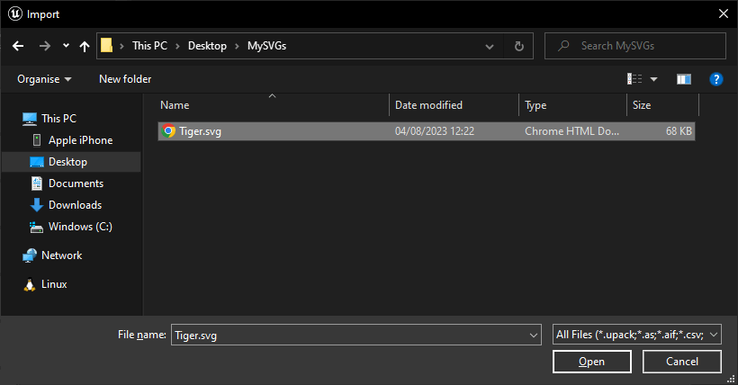

# Importing and using SVGs as assets

This section shows how to import SVG as assets in the UE Editor and use them in a game.

## Importing from a File

To create a SVG asset from a file, open the Editor and click on `Import` in the content browser.

<div class="centered">


</div>

In the native content browser, select your SVG file and select `Open`.

<div class="centered">



</div>

A new asset has now appeared in the content browser. If the SVG is valid, it will be displayed as icon for the asset. Hit `CTRL + S` to save the asset.

<div class="centered">


</div>

> You can also drag and drop the SVG file in the content browser directly as any other asset.

## Importing from a SVG String

Open the UE Editor and right click in the content browser and select `User Interface` > `SVG`.

<div class="centered">


</div>

Name your asset and double click it to open the SVG editor.

<div class="centered">


</div>

Paste your SVG data in the right input box and hit `CTRL + S` to save the result. The rendering of the asset is shown in the left panel.

<div class="centered">


</div>

!> The SVG is rendered at `1024x1024` pixels in this editor and stretches to fill the space. Don't worry if you have a high definition screen and the SVG looks pixelated, it can be changed in game.

And that's it, you now have a SVG asset ready to be displayed in your game.

> **Hint**: You can click on `Minify` to reduce the asset size.

## Rendering a Texture from an Asset

A texture of a SVG asset can be created in any graph by using the following code.


<div class="code-switcher show-cpp-false"><div class="switcher">
<span class="sw-bp" onclick="switchBp()">Blueprints</span><span class="sw-cpp" onclick="switchCpp()">C++</span></div>
<div class="cpp">

```cpp
// Loads the asset from its path. 
USVGAsset* MySVGAsset = LoadObject<USVGAsset>(GetTransientPackage(), TEXT("/Script/SVG.SVGAsset'/Game/MySVGs/MySVG.MySVG'"));

// The interesting part: renders the asset to a texture.
UTexture2D* Texture = USVGAsset::RenderToTexture(MySVGAsset, 1024, 1024, FLinearColor::Transparent);
```

</div>
<div class="bp">
<div class="bpcode">
<textarea readonly>
Begin Object Class=/Script/BlueprintGraph.K2Node_CustomEvent Name="K2Node_CustomEvent_0" ExportPath=/Script/BlueprintGraph.K2Node_CustomEvent'"/Game/Demo/DemoActor.DemoActor:EventGraph.K2Node_CustomEvent_0"'
   CustomFunctionName="Render SVG Asset"
   NodePosX=-384
   NodePosY=15
   NodeGuid=8180B42A4F325F17435DA2BA3EFD1CD9
   CustomProperties Pin (PinId=3E6A428E46B22C2CB97DCB88B7FA692E,PinName="OutputDelegate",Direction="EGPD_Output",PinType.PinCategory="delegate",PinType.PinSubCategory="",PinType.PinSubCategoryObject=None,PinType.PinSubCategoryMemberReference=(MemberParent=/Script/Engine.BlueprintGeneratedClass'"/Game/Demo/DemoActor.DemoActor_C"',MemberName="Render SVG Asset",MemberGuid=8180B42A4F325F17435DA2BA3EFD1CD9),PinType.PinValueType=(),PinType.ContainerType=None,PinType.bIsReference=False,PinType.bIsConst=False,PinType.bIsWeakPointer=False,PinType.bIsUObjectWrapper=False,PinType.bSerializeAsSinglePrecisionFloat=False,PersistentGuid=00000000000000000000000000000000,bHidden=False,bNotConnectable=False,bDefaultValueIsReadOnly=False,bDefaultValueIsIgnored=False,bAdvancedView=False,bOrphanedPin=False,)
   CustomProperties Pin (PinId=5F1429C648262AA061CA9B840B80F302,PinName="then",Direction="EGPD_Output",PinType.PinCategory="exec",PinType.PinSubCategory="",PinType.PinSubCategoryObject=None,PinType.PinSubCategoryMemberReference=(),PinType.PinValueType=(),PinType.ContainerType=None,PinType.bIsReference=False,PinType.bIsConst=False,PinType.bIsWeakPointer=False,PinType.bIsUObjectWrapper=False,PinType.bSerializeAsSinglePrecisionFloat=False,LinkedTo=(K2Node_CallFunction_0 23B6DE7444E3920C1492B782DF10AC3D,),PersistentGuid=00000000000000000000000000000000,bHidden=False,bNotConnectable=False,bDefaultValueIsReadOnly=False,bDefaultValueIsIgnored=False,bAdvancedView=False,bOrphanedPin=False,)
End Object
Begin Object Class=/Script/BlueprintGraph.K2Node_CallFunction Name="K2Node_CallFunction_0" ExportPath=/Script/BlueprintGraph.K2Node_CallFunction'"/Game/Demo/DemoActor.DemoActor:EventGraph.K2Node_CallFunction_0"'
   FunctionReference=(MemberParent=/Script/CoreUObject.Class'"/Script/SVG.SVGAsset"',MemberName="RenderToTexture")
   NodePosX=-176
   NodePosY=32
   NodeGuid=CBA6F52046107152258CDDAD0903725D
   CustomProperties Pin (PinId=23B6DE7444E3920C1492B782DF10AC3D,PinName="execute",PinToolTip="\nExec",PinType.PinCategory="exec",PinType.PinSubCategory="",PinType.PinSubCategoryObject=None,PinType.PinSubCategoryMemberReference=(),PinType.PinValueType=(),PinType.ContainerType=None,PinType.bIsReference=False,PinType.bIsConst=False,PinType.bIsWeakPointer=False,PinType.bIsUObjectWrapper=False,PinType.bSerializeAsSinglePrecisionFloat=False,LinkedTo=(K2Node_CustomEvent_0 5F1429C648262AA061CA9B840B80F302,),PersistentGuid=00000000000000000000000000000000,bHidden=False,bNotConnectable=False,bDefaultValueIsReadOnly=False,bDefaultValueIsIgnored=False,bAdvancedView=False,bOrphanedPin=False,)
   CustomProperties Pin (PinId=ACA2F43F48D38EACEBF83985E687D250,PinName="then",PinToolTip="\nExec",Direction="EGPD_Output",PinType.PinCategory="exec",PinType.PinSubCategory="",PinType.PinSubCategoryObject=None,PinType.PinSubCategoryMemberReference=(),PinType.PinValueType=(),PinType.ContainerType=None,PinType.bIsReference=False,PinType.bIsConst=False,PinType.bIsWeakPointer=False,PinType.bIsUObjectWrapper=False,PinType.bSerializeAsSinglePrecisionFloat=False,PersistentGuid=00000000000000000000000000000000,bHidden=False,bNotConnectable=False,bDefaultValueIsReadOnly=False,bDefaultValueIsIgnored=False,bAdvancedView=False,bOrphanedPin=False,)
   CustomProperties Pin (PinId=A03B67AF4686A7A56DEC0CB4F735D2D9,PinName="self",PinFriendlyName=NSLOCTEXT("K2Node", "Target", "Target"),PinToolTip="Target\nSVGAsset Object Reference",PinType.PinCategory="object",PinType.PinSubCategory="",PinType.PinSubCategoryObject=/Script/CoreUObject.Class'"/Script/SVG.SVGAsset"',PinType.PinSubCategoryMemberReference=(),PinType.PinValueType=(),PinType.ContainerType=None,PinType.bIsReference=False,PinType.bIsConst=False,PinType.bIsWeakPointer=False,PinType.bIsUObjectWrapper=False,PinType.bSerializeAsSinglePrecisionFloat=False,DefaultObject="/Script/SVG.Default__SVGAsset",PersistentGuid=00000000000000000000000000000000,bHidden=True,bNotConnectable=False,bDefaultValueIsReadOnly=False,bDefaultValueIsIgnored=False,bAdvancedView=False,bOrphanedPin=False,)
   CustomProperties Pin (PinId=98CBB79C4D47C774C3A123ACBDBF992F,PinName="Asset",PinToolTip="Asset\nSVGAsset Object Reference\n\nThe asset to render.",PinType.PinCategory="object",PinType.PinSubCategory="",PinType.PinSubCategoryObject=/Script/CoreUObject.Class'"/Script/SVG.SVGAsset"',PinType.PinSubCategoryMemberReference=(),PinType.PinValueType=(),PinType.ContainerType=None,PinType.bIsReference=False,PinType.bIsConst=False,PinType.bIsWeakPointer=False,PinType.bIsUObjectWrapper=False,PinType.bSerializeAsSinglePrecisionFloat=False,DefaultObject="/Game/SVG/Tiger.Tiger",PersistentGuid=00000000000000000000000000000000,bHidden=False,bNotConnectable=False,bDefaultValueIsReadOnly=False,bDefaultValueIsIgnored=False,bAdvancedView=False,bOrphanedPin=False,)
   CustomProperties Pin (PinId=7E8C54324F9F5A1075073F95B69550A3,PinName="Width",PinToolTip="Width\nInteger\n\nThe number of pixel to render on the X axis.",PinType.PinCategory="int",PinType.PinSubCategory="",PinType.PinSubCategoryObject=None,PinType.PinSubCategoryMemberReference=(),PinType.PinValueType=(),PinType.ContainerType=None,PinType.bIsReference=False,PinType.bIsConst=False,PinType.bIsWeakPointer=False,PinType.bIsUObjectWrapper=False,PinType.bSerializeAsSinglePrecisionFloat=False,DefaultValue="1024",AutogeneratedDefaultValue="0",PersistentGuid=00000000000000000000000000000000,bHidden=False,bNotConnectable=False,bDefaultValueIsReadOnly=False,bDefaultValueIsIgnored=False,bAdvancedView=False,bOrphanedPin=False,)
   CustomProperties Pin (PinId=C73629B64A3B0BC88F0B9A88B91DDC84,PinName="Height",PinToolTip="Height\nInteger\n\nThe number of pixel to render on the Y axis.",PinType.PinCategory="int",PinType.PinSubCategory="",PinType.PinSubCategoryObject=None,PinType.PinSubCategoryMemberReference=(),PinType.PinValueType=(),PinType.ContainerType=None,PinType.bIsReference=False,PinType.bIsConst=False,PinType.bIsWeakPointer=False,PinType.bIsUObjectWrapper=False,PinType.bSerializeAsSinglePrecisionFloat=False,DefaultValue="1024",AutogeneratedDefaultValue="0",PersistentGuid=00000000000000000000000000000000,bHidden=False,bNotConnectable=False,bDefaultValueIsReadOnly=False,bDefaultValueIsIgnored=False,bAdvancedView=False,bOrphanedPin=False,)
   CustomProperties Pin (PinId=99D3E63446454A66C6DF2FBF6C169B06,PinName="BackgroundColor",PinToolTip="Background Color\nLinear Color Structure\n\nThe background color of the SVG.",PinType.PinCategory="struct",PinType.PinSubCategory="",PinType.PinSubCategoryObject=/Script/CoreUObject.ScriptStruct'"/Script/CoreUObject.LinearColor"',PinType.PinSubCategoryMemberReference=(),PinType.PinValueType=(),PinType.ContainerType=None,PinType.bIsReference=False,PinType.bIsConst=False,PinType.bIsWeakPointer=False,PinType.bIsUObjectWrapper=False,PinType.bSerializeAsSinglePrecisionFloat=False,DefaultValue="(R=0.000000,G=0.000000,B=0.000000,A=0.000000)",AutogeneratedDefaultValue="(R=0.000000,G=0.000000,B=0.000000,A=0.000000)",PersistentGuid=00000000000000000000000000000000,bHidden=False,bNotConnectable=False,bDefaultValueIsReadOnly=False,bDefaultValueIsIgnored=False,bAdvancedView=False,bOrphanedPin=False,)
   CustomProperties Pin (PinId=9473EA36420618DC84A992BAF6943915,PinName="ReturnValue",PinFriendlyName="Texture",PinToolTip="Texture\nTexture 2D Object Reference\n\nA texture of the SVG.",Direction="EGPD_Output",PinType.PinCategory="object",PinType.PinSubCategory="",PinType.PinSubCategoryObject=/Script/CoreUObject.Class'"/Script/Engine.Texture2D"',PinType.PinSubCategoryMemberReference=(),PinType.PinValueType=(),PinType.ContainerType=None,PinType.bIsReference=False,PinType.bIsConst=False,PinType.bIsWeakPointer=False,PinType.bIsUObjectWrapper=False,PinType.bSerializeAsSinglePrecisionFloat=False,PersistentGuid=00000000000000000000000000000000,bHidden=False,bNotConnectable=False,bDefaultValueIsReadOnly=False,bDefaultValueIsIgnored=False,bAdvancedView=False,bOrphanedPin=False,)
End Object
</textarea>

<button onclick="copyBlueprintCode(this)">Copy Code</button>
</div>
</div>
</div>

!> You want to edit `Width` and `Height` depending on the usage of your texture. Higher values mean better quality, but higher computational and memory cost.

## Show a SVG in the UI

### Create a Widget
If you don't have a widget to display the SVG, start by creating one. Right click in the content browser and select `User Interface` > `Widget Blueprint`.


<div class="centered">


</div>

Select `User Widget` as parent class.

<div class="centered">


</div>

Give a name to your new widget.

<div class="centered">


</div>

And double click the newly created widget to open the editor. In the widget editor, drag an image where the SVG will be rendered. Give a name to the image and mark it as `Is Variable`.

<div class="centered">


</div>

### Render the SVG in a `UImage`

Now that we have added a `UImage` to our widget, we can use it to show the SVG. Start by opening the Blueprint Graph

<div class="centered">


</div>

And use the `Set SVG` node to render the asset inside the image.

<div class="centered">

<div class="bpcode">
<textarea readonly>
Begin Object Class=/Script/BlueprintGraph.K2Node_VariableGet Name="K2Node_VariableGet_0" ExportPath=/Script/BlueprintGraph.K2Node_VariableGet'"/Game/MySVGs/MyWidget.MyWidget:EventGraph.K2Node_VariableGet_0"'
   VariableReference=(MemberName="MyImage",bSelfContext=True)
   NodePosX=144
   NodePosY=544
   NodeGuid=11B7FF7D4FB31E481269018EC34CE54F
   CustomProperties Pin (PinId=46E86FE54C0018DD3E64819BC15A5331,PinName="MyImage",Direction="EGPD_Output",PinType.PinCategory="object",PinType.PinSubCategory="",PinType.PinSubCategoryObject=/Script/CoreUObject.Class'"/Script/UMG.Image"',PinType.PinSubCategoryMemberReference=(),PinType.PinValueType=(),PinType.ContainerType=None,PinType.bIsReference=False,PinType.bIsConst=False,PinType.bIsWeakPointer=False,PinType.bIsUObjectWrapper=False,PinType.bSerializeAsSinglePrecisionFloat=False,LinkedTo=(K2Node_CallFunction_0 A68355E44A161026E512ACBAFF999AF3,),PersistentGuid=00000000000000000000000000000000,bHidden=False,bNotConnectable=False,bDefaultValueIsReadOnly=False,bDefaultValueIsIgnored=False,bAdvancedView=False,bOrphanedPin=False,)
   CustomProperties Pin (PinId=683897264EF53EBA634B9F95B5F61FCB,PinName="self",PinFriendlyName=NSLOCTEXT("K2Node", "Target", "Target"),PinType.PinCategory="object",PinType.PinSubCategory="",PinType.PinSubCategoryObject=/Script/UMG.WidgetBlueprintGeneratedClass'"/Game/MySVGs/MyWidget.MyWidget_C"',PinType.PinSubCategoryMemberReference=(),PinType.PinValueType=(),PinType.ContainerType=None,PinType.bIsReference=False,PinType.bIsConst=False,PinType.bIsWeakPointer=False,PinType.bIsUObjectWrapper=False,PinType.bSerializeAsSinglePrecisionFloat=False,PersistentGuid=00000000000000000000000000000000,bHidden=True,bNotConnectable=False,bDefaultValueIsReadOnly=False,bDefaultValueIsIgnored=False,bAdvancedView=False,bOrphanedPin=False,)
End Object
Begin Object Class=/Script/BlueprintGraph.K2Node_CallFunction Name="K2Node_CallFunction_0" ExportPath=/Script/BlueprintGraph.K2Node_CallFunction'"/Game/MySVGs/MyWidget.MyWidget:EventGraph.K2Node_CallFunction_0"'
   FunctionReference=(MemberParent=/Script/CoreUObject.Class'"/Script/SVG.SVGAsset"',MemberName="SetSVG")
   NodePosX=352
   NodePosY=435
   NodeGuid=50F4812042957009CFC7279F3CED1131
   CustomProperties Pin (PinId=C5E21075442026C9B995419C1073C632,PinName="execute",PinToolTip="\nExec",PinType.PinCategory="exec",PinType.PinSubCategory="",PinType.PinSubCategoryObject=None,PinType.PinSubCategoryMemberReference=(),PinType.PinValueType=(),PinType.ContainerType=None,PinType.bIsReference=False,PinType.bIsConst=False,PinType.bIsWeakPointer=False,PinType.bIsUObjectWrapper=False,PinType.bSerializeAsSinglePrecisionFloat=False,LinkedTo=(K2Node_Event_4 656D6F6149A58C84E2DDB0B91D8C1DDF,),PersistentGuid=00000000000000000000000000000000,bHidden=False,bNotConnectable=False,bDefaultValueIsReadOnly=False,bDefaultValueIsIgnored=False,bAdvancedView=False,bOrphanedPin=False,)
   CustomProperties Pin (PinId=6FEB2D6846893BF065081FA948A7D873,PinName="then",PinToolTip="\nExec",Direction="EGPD_Output",PinType.PinCategory="exec",PinType.PinSubCategory="",PinType.PinSubCategoryObject=None,PinType.PinSubCategoryMemberReference=(),PinType.PinValueType=(),PinType.ContainerType=None,PinType.bIsReference=False,PinType.bIsConst=False,PinType.bIsWeakPointer=False,PinType.bIsUObjectWrapper=False,PinType.bSerializeAsSinglePrecisionFloat=False,PersistentGuid=00000000000000000000000000000000,bHidden=False,bNotConnectable=False,bDefaultValueIsReadOnly=False,bDefaultValueIsIgnored=False,bAdvancedView=False,bOrphanedPin=False,)
   CustomProperties Pin (PinId=4F21C9694D46C4C9FBD6189828965885,PinName="self",PinFriendlyName=NSLOCTEXT("K2Node", "Target", "Target"),PinToolTip="Target\nSVGAsset Object Reference",PinType.PinCategory="object",PinType.PinSubCategory="",PinType.PinSubCategoryObject=/Script/CoreUObject.Class'"/Script/SVG.SVGAsset"',PinType.PinSubCategoryMemberReference=(),PinType.PinValueType=(),PinType.ContainerType=None,PinType.bIsReference=False,PinType.bIsConst=False,PinType.bIsWeakPointer=False,PinType.bIsUObjectWrapper=False,PinType.bSerializeAsSinglePrecisionFloat=False,DefaultObject="/Script/SVG.Default__SVGAsset",PersistentGuid=00000000000000000000000000000000,bHidden=True,bNotConnectable=False,bDefaultValueIsReadOnly=False,bDefaultValueIsIgnored=False,bAdvancedView=False,bOrphanedPin=False,)
   CustomProperties Pin (PinId=A68355E44A161026E512ACBAFF999AF3,PinName="Image",PinToolTip="Image\nImage Object Reference\n\nThe image to set the texture of.",PinType.PinCategory="object",PinType.PinSubCategory="",PinType.PinSubCategoryObject=/Script/CoreUObject.Class'"/Script/UMG.Image"',PinType.PinSubCategoryMemberReference=(),PinType.PinValueType=(),PinType.ContainerType=None,PinType.bIsReference=False,PinType.bIsConst=False,PinType.bIsWeakPointer=False,PinType.bIsUObjectWrapper=False,PinType.bSerializeAsSinglePrecisionFloat=False,LinkedTo=(K2Node_VariableGet_0 46E86FE54C0018DD3E64819BC15A5331,),PersistentGuid=00000000000000000000000000000000,bHidden=False,bNotConnectable=False,bDefaultValueIsReadOnly=False,bDefaultValueIsIgnored=False,bAdvancedView=False,bOrphanedPin=False,)
   CustomProperties Pin (PinId=CDF3386D44DA09428650ECB56DE9233C,PinName="Asset",PinToolTip="Asset\nSVGAsset Object Reference\n\nThe asset to render in the image.",PinType.PinCategory="object",PinType.PinSubCategory="",PinType.PinSubCategoryObject=/Script/CoreUObject.Class'"/Script/SVG.SVGAsset"',PinType.PinSubCategoryMemberReference=(),PinType.PinValueType=(),PinType.ContainerType=None,PinType.bIsReference=False,PinType.bIsConst=False,PinType.bIsWeakPointer=False,PinType.bIsUObjectWrapper=False,PinType.bSerializeAsSinglePrecisionFloat=False,DefaultObject="/Game/SVG/Tiger.Tiger",PersistentGuid=00000000000000000000000000000000,bHidden=False,bNotConnectable=False,bDefaultValueIsReadOnly=False,bDefaultValueIsIgnored=False,bAdvancedView=False,bOrphanedPin=False,)
   CustomProperties Pin (PinId=9428C9CD4F74380FB7E172B1489A0D01,PinName="Width",PinToolTip="Width\nInteger\n\nThe number of pixel to render on the X axis.",PinType.PinCategory="int",PinType.PinSubCategory="",PinType.PinSubCategoryObject=None,PinType.PinSubCategoryMemberReference=(),PinType.PinValueType=(),PinType.ContainerType=None,PinType.bIsReference=False,PinType.bIsConst=False,PinType.bIsWeakPointer=False,PinType.bIsUObjectWrapper=False,PinType.bSerializeAsSinglePrecisionFloat=False,DefaultValue="1024",AutogeneratedDefaultValue="0",PersistentGuid=00000000000000000000000000000000,bHidden=False,bNotConnectable=False,bDefaultValueIsReadOnly=False,bDefaultValueIsIgnored=False,bAdvancedView=False,bOrphanedPin=False,)
   CustomProperties Pin (PinId=05A909234DACE28FC5ADFAAF7B082E83,PinName="Height",PinToolTip="Height\nInteger\n\nThe number of pixel to render on the Y axis.",PinType.PinCategory="int",PinType.PinSubCategory="",PinType.PinSubCategoryObject=None,PinType.PinSubCategoryMemberReference=(),PinType.PinValueType=(),PinType.ContainerType=None,PinType.bIsReference=False,PinType.bIsConst=False,PinType.bIsWeakPointer=False,PinType.bIsUObjectWrapper=False,PinType.bSerializeAsSinglePrecisionFloat=False,DefaultValue="1024",AutogeneratedDefaultValue="0",PersistentGuid=00000000000000000000000000000000,bHidden=False,bNotConnectable=False,bDefaultValueIsReadOnly=False,bDefaultValueIsIgnored=False,bAdvancedView=False,bOrphanedPin=False,)
   CustomProperties Pin (PinId=EE778BC743A80680BFECCCA160880B09,PinName="BackgroundColor",PinToolTip="Background Color\nLinear Color Structure\n\nThe background color of the SVG.",PinType.PinCategory="struct",PinType.PinSubCategory="",PinType.PinSubCategoryObject=/Script/CoreUObject.ScriptStruct'"/Script/CoreUObject.LinearColor"',PinType.PinSubCategoryMemberReference=(),PinType.PinValueType=(),PinType.ContainerType=None,PinType.bIsReference=False,PinType.bIsConst=False,PinType.bIsWeakPointer=False,PinType.bIsUObjectWrapper=False,PinType.bSerializeAsSinglePrecisionFloat=False,DefaultValue="(R=0.000000,G=0.000000,B=0.000000,A=0.000000)",PersistentGuid=00000000000000000000000000000000,bHidden=False,bNotConnectable=False,bDefaultValueIsReadOnly=False,bDefaultValueIsIgnored=False,bAdvancedView=False,bOrphanedPin=False,)
End Object
Begin Object Class=/Script/BlueprintGraph.K2Node_Event Name="K2Node_Event_4" ExportPath=/Script/BlueprintGraph.K2Node_Event'"/Game/MySVGs/MyWidget.MyWidget:EventGraph.K2Node_Event_4"'
   EventReference=(MemberParent=/Script/CoreUObject.Class'"/Script/UMG.UserWidget"',MemberName="PreConstruct")
   bOverrideFunction=True
   NodePosX=112
   NodePosY=432
   NodeGuid=E1B15F984B6DB3707B2CD0984133915D
   CustomProperties Pin (PinId=A7E0E4C6432F7FB48B6667940E571B1B,PinName="OutputDelegate",Direction="EGPD_Output",PinType.PinCategory="delegate",PinType.PinSubCategory="",PinType.PinSubCategoryObject=None,PinType.PinSubCategoryMemberReference=(MemberParent=/Script/CoreUObject.Class'"/Script/UMG.UserWidget"',MemberName="PreConstruct"),PinType.PinValueType=(),PinType.ContainerType=None,PinType.bIsReference=False,PinType.bIsConst=False,PinType.bIsWeakPointer=False,PinType.bIsUObjectWrapper=False,PinType.bSerializeAsSinglePrecisionFloat=False,PersistentGuid=00000000000000000000000000000000,bHidden=False,bNotConnectable=False,bDefaultValueIsReadOnly=False,bDefaultValueIsIgnored=False,bAdvancedView=False,bOrphanedPin=False,)
   CustomProperties Pin (PinId=656D6F6149A58C84E2DDB0B91D8C1DDF,PinName="then",Direction="EGPD_Output",PinType.PinCategory="exec",PinType.PinSubCategory="",PinType.PinSubCategoryObject=None,PinType.PinSubCategoryMemberReference=(),PinType.PinValueType=(),PinType.ContainerType=None,PinType.bIsReference=False,PinType.bIsConst=False,PinType.bIsWeakPointer=False,PinType.bIsUObjectWrapper=False,PinType.bSerializeAsSinglePrecisionFloat=False,LinkedTo=(K2Node_CallFunction_0 C5E21075442026C9B995419C1073C632,),PersistentGuid=00000000000000000000000000000000,bHidden=False,bNotConnectable=False,bDefaultValueIsReadOnly=False,bDefaultValueIsIgnored=False,bAdvancedView=False,bOrphanedPin=False,)
   CustomProperties Pin (PinId=A249497142D9B9936D02E39643C0A4B6,PinName="IsDesignTime",PinToolTip="Is Design Time\nBoolean",Direction="EGPD_Output",PinType.PinCategory="bool",PinType.PinSubCategory="",PinType.PinSubCategoryObject=None,PinType.PinSubCategoryMemberReference=(),PinType.PinValueType=(),PinType.ContainerType=None,PinType.bIsReference=False,PinType.bIsConst=False,PinType.bIsWeakPointer=False,PinType.bIsUObjectWrapper=False,PinType.bSerializeAsSinglePrecisionFloat=False,DefaultValue="false",AutogeneratedDefaultValue="false",PersistentGuid=00000000000000000000000000000000,bHidden=False,bNotConnectable=False,bDefaultValueIsReadOnly=False,bDefaultValueIsIgnored=False,bAdvancedView=False,bOrphanedPin=False,)
End Object
</textarea>

<button onclick="copyBlueprintCode(this)">Copy Code</button>
</div>

</div>

!> You want to edit `Width` and `Height` depending on the usage of your texture. Higher values mean better quality, but higher computational and memory cost.

<script>
setTimeout(() => {
	bShowCPP = !JSON.parse(getCookie('bShowCPP'));
	switchCode();
}, 0);
</script>


